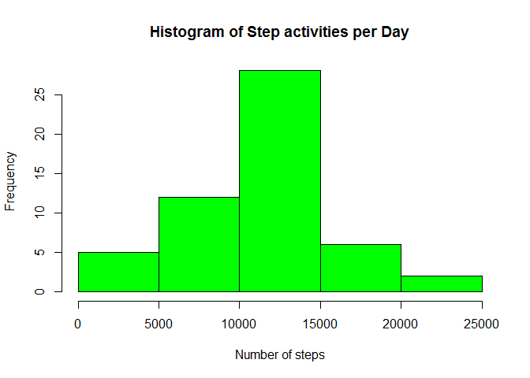
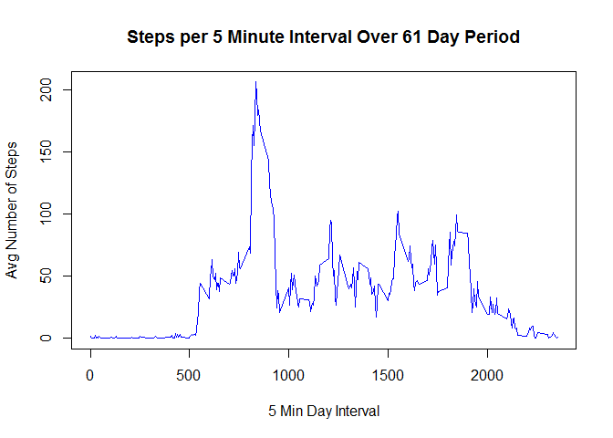
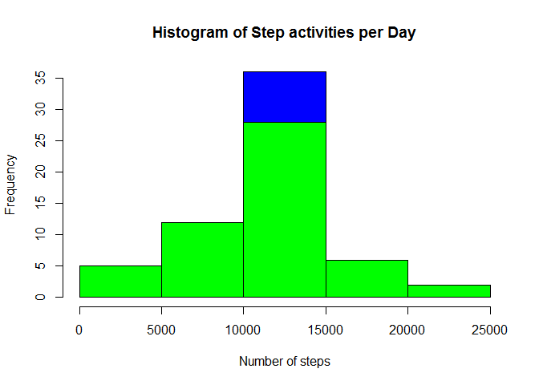
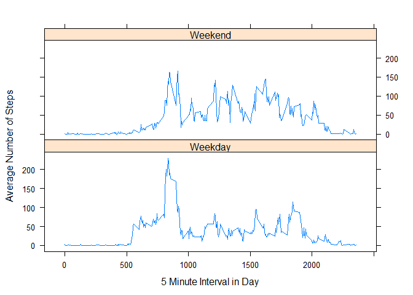

# Reproducible Research: Peer Assessment 1


## Loading and preprocessing the data
Loading and processing the data uses the activities.zip datafile available in this repository.
The data file is comma separated values with NA designated by the string "NA".   
Three variables are defined:
     - steps   : integer, number of steps taken per day per interval
     - date    : string, in the form of yyyy-mm-dd
     - interval: integer, 5-minute interval per 24 hour day
     
Steps include:
     1. Setup our library environment
     2. Unzip the archive
     3. Read the file into memory: this is a CSV file whose NA values are designated by the string "NA"
     4. In order to ensure proper date operations, we add a 4th column, posix_date with date objects.

```r
     library(plyr)
     library(data.table)
     library(lubridate)
     library(lattice)
                                               
     unzip("activity.zip")
     

     activities <- fread("activity.csv",sep=",",header=TRUE,na.strings=c("NA"),stringsAsFactors=FALSE,verbose=FALSE)
     activities$posix_date <- ymd(activities$date)
```

## What is mean total number of steps taken per day?
Our analytic question asks the number of steps taken per day.  As our data gives steps per day per interval, it's necessary to aggregate our step data grouped by date.  To do this, the plyr library is used with ddply to generate a summary table of steps taken per day along with some summary statistics information.  Per the assignment question, the NA values are ignored.

The following code block generates a table with aggregate step data grouped by date; and an additional table with aggregate step data grouped by interval.


```r
steps_by_date <- ddply((activities), .(date,posix_date), summarize, mean_steps = mean(steps,na.rm=T), 
                       total_steps = sum(steps,na.rm=T), count=length(date), na_count = sum(is.na(steps)))

steps_per_interval <- ddply((activities), .(interval), summarize, mean_steps = mean(steps,na.rm=T), 
                            total_steps = sum(steps,na.rm=T), count=length(interval), na_count = sum(is.na(steps)))
```

Using our aggregate data tables, let's take a look at the daily step data by doing the following analysis:
     1. Generate a histogram of daily step data
     2. Calculate the mean and median of the daily step data.

We can see that the steps are approximatley normally distributed and that both the mean and median show that our activity subject typically walks about 10,765 steps per day.  The average step-stride is about .75m, which gives about 8km of walking per day.  This seems like a reasonable finding.


```r
hist(
     steps_by_date$total_steps[steps_by_date$total_steps >0],
     col="green", xlab="Number of steps",main="Histogram of Step activities per Day")
```

 

```r
cbind(
      mean=mean(steps_by_date$total_steps[steps_by_date$total_steps > 0 ]),
      median=median(steps_by_date$total_steps[steps_by_date$total_steps > 0 ]))
```

```
##          mean median
## [1,] 10766.19  10765
```

## What is the average daily activity pattern?

Now, let's look across a typical daily activity pattern across our daily interval measurements.  Using our aggregate step data by interval generated above, we can analyze a typical day by (1) Making a time series plot.  

The data show a clear spike in the daily activity pattern at minute 835, or at about 13h50; however, this peak spans a period from about minute 800 to minute 925, or about a two-hour period between 13h20 and 15h25.  This suggests our subject may engage in sports (possibly jogging, or power walking) during the afternoon.  

Overall activity is quite diminished between minute 0 through minute 540, or about 9am.  Our subject enjoyed a solid night's rest and appears to get up at a leisurely 9am.  He or she is probably a student who can sleep late and go for a two hour run every afternoon.


```r
plot(
     type="l",x=steps_per_interval$interval,y=steps_per_interval$mean_steps,
     col="blue",xlab="5 Min Day Interval",ylab="Avg Number of Steps",
     main="Steps per 5 Minute Interval Over 61 Day Period")
```

 

```r
steps_per_interval[steps_per_interval$mean_steps==max(steps_per_interval$mean_steps),]
```

```
##     interval mean_steps total_steps count na_count
## 104      835   206.1698       10927    61        8
```

## Imputing missing values
A few days contain NA entries, possibly a consequence of forgetting to charge the activity band.  In total, our dataset contains 8 full days of missing values.  Or as specified in the assignment question, (1) 2,304 missing rows of data.  Here, we've used the na.omit() function to eject incomplete rows and calculate the difference.


```r
cbind(
     total_rows = nrow(activities), 
     total_rows_without_na = nrow(na.omit(activities)), 
     total_na_rows = nrow(activities)-nrow(na.omit(activities)))
```

```
##      total_rows total_rows_without_na total_na_rows
## [1,]      17568                 15264          2304
```

Lacking data, (2) the empty periods are filled using the mean daily interval values calculated previously.  (3) A filled data set is created with the completed values.

What's the consequence of doing this?  Not much.  (4) Looking at a histogram of the filled data set, this doesn't shift our distribution too much since we're filling the data using mean values.  Naturally, the amplitude of our distribution increases since we have an increased number of typical observations (the interval means).  This is illustrated in the histogram below, which plots first the previous activity distribution (green) overlayed on our filled activity data (blue).  We can see the higher amplitude with increased frequency about the mean.  

(4) The calculated mean and medium of course remain at approximately 10,765 steps; the precise median shifts in equivalence to the mean, a consequency of setting the mean value for each of the 8 missing days, making it singly most common observation.


```r
     activities_fill <- activities

     activities_fill$fill_steps <- steps_per_interval$mean_steps[match(activities_fill$interval,steps_per_interval$interval)]
     activities_fill$steps[is.na(activities_fill$steps)] <- activities_fill$fill_steps[is.na(activities_fill$steps)]

     steps_by_date_fill <- ddply(
                                   (activities_fill), .(date,posix_date), summarize, 
                                   mean_steps = mean(steps,na.rm=T), 
                                   total_steps = sum(steps,na.rm=T), 
                                   count=length(date), 
                                   na_count = sum(is.na(steps)))
     
     hist(
          steps_by_date_fill$total_steps, 
          col=rgb(0,0,1,1), xlab="Number of steps", main="Histogram of Step activities per Day")

     hist(
          steps_by_date$total_steps[steps_by_date$total_steps >0], 
          col="green", xlab="Number of steps", main="Histogram of Step activities per Day",add=T)
```

 

```r
     cbind(
          mean=mean(steps_by_date_fill$total_steps),
          median=median(steps_by_date_fill$total_steps))
```

```
##          mean   median
## [1,] 10766.19 10766.19
```

## Are there differences in activity patterns between weekdays and weekends?

There are differences between weekday and weekend activity patterns.  This is seen by (1) creating a two-level factor variable that assigns weekends a value of 1 and weekdays a value of 2.  Aggregating steps by day-type and plotting a timeseries panel plot illustrates this.  Notably, on the weekends, the start of activity is more gradual, showing that our subject has a more leisurely and more variable wake-up time.  There remains a peak of activity in the afternoon around 13h-15h, but its diminished; however, overall activity is much higher throughout the day and continuing into the evening (but not too late).  Apparently our would-be student subject doesn't seem to party too much on the weekends.


```r
activities_fill$day_type <- factor(
                                   x=as.numeric(is.na(match(weekdays(activities_fill$posix_date),
                                   c("Saturday","Sunday"))))+1,levels=c(2,1),
                                   labels=c("Weekday","Weekend"))

steps_by_day_type <- ddply(
                           (activities_fill), .(day_type,interval), summarize, 
                           mean_steps = mean(steps,na.rm=T), 
                           total_steps = sum(steps,na.rm=T), 
                           count=length(day_type), 
                           na_count = sum(is.na(steps)))

xyplot(
       steps_by_day_type$mean_steps~steps_by_day_type$interval|day_type,
       data=steps_by_day_type,
       type="l",
       layout=c(1,2),
       xlab="5 Minute Interval in Day",
       ylab="Average Number of Steps")
```

 
